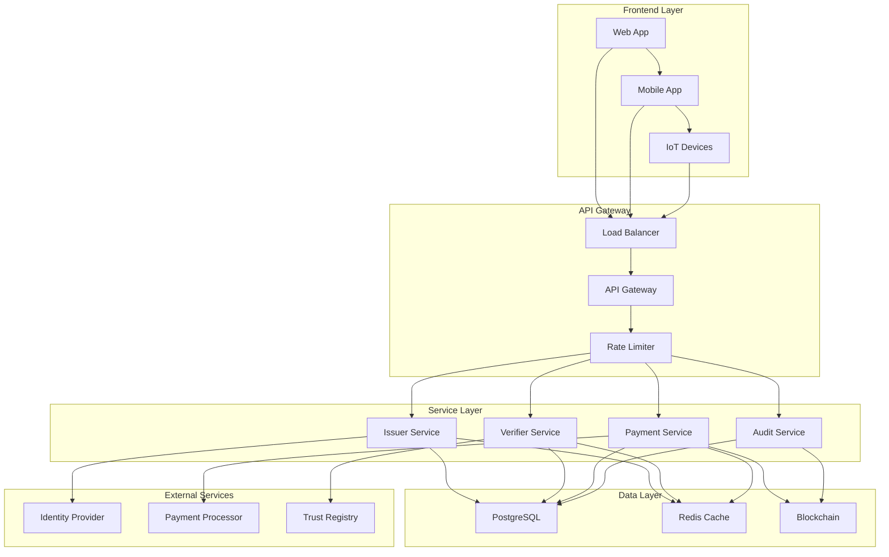

# FinPass - Decentralized Identity and Payment System

[](https://github.com/finpass/finpass)
[](https://opensource.org/licenses/MIT)
[](https://openjdk.java.net/projects/jdk-se/17/)
[](https://spring.io/projects/spring-boot)

FinPass is a comprehensive decentralized identity and payment system built on blockchain technology. It provides secure, privacy-preserving digital identity credentials integrated with seamless payment processing, all backed by comprehensive audit logging for regulatory compliance.

## 🌟 Key Features

### 🔐 Decentralized Identity
- **DID-based Identity Management**: W3C-compliant Decentralized Identifiers
- **Verifiable Credentials**: Standard-compliant credential issuance and verification
- **Privacy-Preserving**: Zero-knowledge proof capabilities and user consent management
- **Multi-Platform Support**: Web, mobile, and IoT device compatibility

### 💳 Secure Payments
- **Blockchain Integration**: Ethereum-compatible smart contract payments
- **Multi-Currency Support**: USD, EUR, and cryptocurrency payments
- **Instant Settlement**: Real-time payment processing and confirmation
- **Fraud Detection**: AI-powered transaction monitoring and prevention

### 📊 Comprehensive Auditing
- **Regulatory Compliance**: GDPR, CCPA, and KYC/AML compliance features
- **Immutable Audit Trail**: Blockchain-based audit logging
- **Real-time Analytics**: Dashboard with comprehensive metrics and insights
- **Privacy-Preserving Logs**: Hashed user data with correlation tracking

### 🛡️ Enterprise Security
- **End-to-End Encryption**: Military-grade cryptographic protection
- **Multi-Factor Authentication**: Biometric, hardware token, and password support
- **Rate Limiting**: Advanced DDoS protection and abuse prevention
- **Error Handling**: Standardized error responses with detailed debugging

## 🏗️ Architecture Overview



## 📋 Prerequisites

### System Requirements
- **Java**: JDK 17 or higher
- **Node.js**: Version 18.x or higher (for frontend)
- **PostgreSQL**: Version 14.x or higher
- **Redis**: Version 6.x or higher
- **Docker**: Version 20.x or higher (optional)
- **Git**: Version 2.x or higher

### Development Tools
- **IDE**: IntelliJ IDEA, VS Code, or Eclipse
- **Build Tool**: Maven 3.8.x or higher
- **API Client**: Postman, Insomnia, or curl
- **Database Tool**: pgAdmin, DBeaver, or similar

### External Dependencies
- **Blockchain Node**: Ethereum or compatible node access
- **Identity Provider**: OAuth 2.0/OpenID Connect provider
- **Payment Gateway**: Stripe, PayPal, or similar integration
- **SSL Certificate**: For HTTPS in production

## 🚀 Quick Start

### 1. Clone the Repository
```bash
git clone https://github.com/finpass/finpass.git
cd finpass
```

### 2. Environment Setup
```bash
# Copy environment template
cp .env.example .env

# Edit environment variables
nano .env
```

### 3. Database Setup
```bash
# Start PostgreSQL and Redis
docker-compose up -d postgres redis

# Run database migrations
./mvnw flyway:migrate -pl issuer
```

### 4. Build and Run Services
```bash
# Build all services
./mvnw clean install

# Start issuer service
cd issuer
./mvnw spring-boot:run

# Start verifier service (in another terminal)
cd ../verifier
./mvnw spring-boot:run

# Start frontend (in another terminal)
cd ../frontend
npm install
npm start
```

### 5. Access the Application
- **API Documentation**: http://localhost:8080/swagger-ui.html
- **Issuer API**: http://localhost:8080/api/issuer
- **Verifier API**: http://localhost:8081/api/verifier
- **Payment API**: http://localhost:8080/api/payments
- **Audit API**: http://localhost:8080/api/audit
- **Frontend**: http://localhost:3000

## 🐳 Docker Setup

### Using Docker Compose
```bash
# Start all services
docker-compose up -d

# View logs
docker-compose logs -f

# Stop services
docker-compose down
```

### Individual Service Containers
```bash
# Build issuer service
cd issuer
docker build -t finpass/issuer .

# Run issuer service
docker run -p 8080:8080 finpass/issuer

# Build verifier service
cd ../verifier
docker build -t finpass/verifier .

# Run verifier service
docker run -p 8081:8081 finpass/verifier
```

## 📚 API Documentation

### Interactive Documentation
- **Swagger UI**: http://localhost:8080/swagger-ui.html
- **OpenAPI Spec**: http://localhost:8080/api-docs

### Key Endpoints

#### Issuer Service
```http
POST   /api/issuer/credentials          # Issue credential
GET    /api/issuer/credentials/{id}     # Get credential details
DELETE /api/issuer/credentials/{id}     # Revoke credential
```

#### Verifier Service
```http
POST   /api/verifier/verify             # Verify credential
GET    /api/verifier/policies/{id}      # Get verification policy
POST   /api/verifier/challenges         # Create verification challenge
```

#### Payment Service
```http
POST   /api/payments                    # Initiate payment
GET    /api/payments/{id}               # Get payment details
POST   /api/payments/{id}/confirm       # Confirm payment
```

#### Audit Service
```http
GET    /api/audit/events                # Get audit events
GET    /api/audit/metrics               # Get audit metrics
POST   /api/audit/search                # Search audit logs
```

### Authentication
All API endpoints require JWT authentication:
```http
Authorization: Bearer <your-jwt-token>
```

### Error Handling
Standardized error response format:
```json
{
  "error": "ERROR_CODE",
  "error_description": "Human-readable description",
  "timestamp": "2023-12-27T10:00:00.000Z",
  "correlation_id": "abc123def456",
  "path": "/api/endpoint"
}
```

## 🎯 Demo Walkthrough

### 1. User Registration and DID Creation
```bash
# Create new user identity
curl -X POST http://localhost:8080/api/issuer/users \
  -H "Content-Type: application/json" \
  -H "Authorization: Bearer <token>" \
  -d '{
    "email": "user@example.com",
    "name": "John Doe"
  }'
```

### 2. Credential Issuance
```bash
# Issue passport credential
curl -X POST http://localhost:8080/api/issuer/credentials \
  -H "Content-Type: application/json" \
  -H "Authorization: Bearer <token>" \
  -d '{
    "holderDid": "did:example:123456789",
    "credentialType": "PASSPORT",
    "credentialData": {
      "passportNumber": "P123456789",
      "fullName": "John Doe",
      "dateOfBirth": "1990-01-01",
      "nationality": "US"
    }
  }'
```

### 3. Credential Verification
```bash
# Verify credential
curl -X POST http://localhost:8081/api/verifier/verify \
  -H "Content-Type: application/json" \
  -H "Authorization: Bearer <token>" \
  -d '{
    "credentialJwt": "eyJhbGciOiJIUzI1NiIsInR5cCI6IkpXVCJ9...",
    "verifierDid": "did:example:verifier123",
    "verificationType": "IDENTITY_VERIFICATION"
  }'
```

### 4. Payment Processing
```bash
# Process payment
curl -X POST http://localhost:8080/api/payments \
  -H "Content-Type: application/json" \
  -H "Authorization: Bearer <token>" \
  -d '{
    "payerDid": "did:example:payer123",
    "payeeDid": "did:example:payee456",
    "amount": 100.50,
    "currency": "USD",
    "paymentMethod": "BANK_TRANSFER"
  }'
```

### 5. Audit Trail
```bash
# Get audit events
curl -X GET "http://localhost:8080/api/audit/events?userIdHash=abc123" \
  -H "Authorization: Bearer <token>"
```

## 🔧 Configuration

### Environment Variables
```bash
# Database Configuration
DB_HOST=localhost
DB_PORT=5432
DB_NAME=finpass
DB_USER=finpass
DB_PASSWORD=your_password

# Security Configuration
JWT_SECRET=your_jwt_secret
OAUTH_CLIENT_ID=your_client_id
OAUTH_CLIENT_SECRET=your_client_secret

# Blockchain Configuration
ETHEREUM_RPC_URL=https://mainnet.infura.io/v3/your_project_id
CONTRACT_ADDRESS=0x1234567890abcdef1234567890abcdef12345678

# External Services
PAYMENT_GATEWAY_API_KEY=your_payment_api_key
IDENTITY_PROVIDER_URL=https://auth.finpass.io
```

### Application Properties
```yaml
# application.yml
spring:
  datasource:
    url: jdbc:postgresql://localhost:5432/finpass
    username: ${DB_USER}
    password: ${DB_PASSWORD}
  
  security:
    oauth2:
      resourceserver:
        jwt:
          issuer-uri: ${IDENTITY_PROVIDER_URL}

springdoc:
  api-docs:
    path: /api-docs
  swagger-ui:
    path: /swagger-ui.html
    try-it-out-enabled: true
```

## 🧪 Testing

### Unit Tests
```bash
# Run all unit tests
./mvnw test

# Run specific test class
./mvnw test -Dtest=ValidationServiceTest

# Run with coverage
./mvnw jacoco:report
```

### Integration Tests
```bash
# Run integration tests
./mvnw verify -P integration-tests

# Run API tests
./mvnw test -P api-tests
```

### Performance Tests
```bash
# Run load tests
cd performance
./run-load-tests.sh

# Run stress tests
./run-stress-tests.sh
```

### Frontend Tests
```bash
cd frontend

# Run unit tests
npm test

# Run integration tests
npm run test:integration

# Run E2E tests
npm run test:e2e
```

## 📊 Monitoring and Observability

### Health Checks
```bash
# Service health
curl http://localhost:8080/actuator/health

# Detailed health info
curl http://localhost:8080/actuator/health/detailed
```

### Metrics
```bash
# Application metrics
curl http://localhost:8080/actuator/metrics

# Prometheus metrics
curl http://localhost:8080/actuator/prometheus
```

### Logging
```bash
# View application logs
tail -f logs/finpass.log

# View error logs
tail -f logs/error.log
```

### Distributed Tracing
```bash
# Zipkin integration
curl http://localhost:9411/zipkin/

# Jaeger integration
curl http://localhost:16686/
```

## 🔒 Security

### Authentication
- **JWT Tokens**: RS256 signed with 2048-bit keys
- **OAuth 2.0**: Authorization code flow with PKCE
- **Multi-Factor**: Biometric, SMS, and authenticator support
- **Session Management**: Secure cookie-based sessions

### Authorization
- **Role-Based Access**: Admin, user, and verifier roles
- **Attribute-Based Access**: Fine-grained permissions
- **API Key Management**: Service-to-service authentication
- **Rate Limiting**: User and IP-based limits

### Data Protection
- **Encryption**: AES-256 for data at rest
- **Transport Security**: TLS 1.3 for data in transit
- **Hashing**: SHA-256 for sensitive data
- **Privacy**: GDPR and CCPA compliance

## 🚀 Deployment

### Production Deployment
```bash
# Build production artifacts
./mvnw clean package -P production

# Deploy to Kubernetes
kubectl apply -f k8s/

# Verify deployment
kubectl get pods -n finpass
```

### Docker Deployment
```bash
# Build production image
docker build -t finpass/issuer:latest .

# Deploy to container registry
docker push your-registry/finpass/issuer:latest

# Run production container
docker run -d \
  --name finpass-issuer \
  -p 8080:8080 \
  -e SPRING_PROFILES_ACTIVE=production \
  finpass/issuer:latest
```

### Cloud Deployment
```bash
# Deploy to AWS
./deploy/aws.sh

# Deploy to Azure
./deploy/azure.sh

# Deploy to GCP
./deploy/gcp.sh
```

## 🔧 Troubleshooting

### Common Issues

#### Database Connection Problems
```bash
# Check database connectivity
psql -h localhost -U finpass -d finpass

# Verify database schema
./mvnw flyway:info

# Repair database
./mvnw flyway:repair
```

#### Authentication Issues
```bash
# Validate JWT token
curl -X POST http://localhost:8080/api/auth/validate \
  -H "Authorization: Bearer <token>"

# Refresh token
curl -X POST http://localhost:8080/api/auth/refresh \
  -H "Content-Type: application/json" \
  -d '{"refreshToken": "<refresh_token>"}'
```

#### Performance Issues
```bash
# Check memory usage
./mvnw spring-boot:run -Dspring-boot.run.jvmArguments="-Xmx2g -Xms1g"

# Profile application
./mvnw spring-boot:run -Dspring.profiles.active=profiling

# Analyze heap dump
jmap -dump:format=b,file=heap.hprof <pid>
```

### Debug Mode
```bash
# Enable debug logging
./mvnw spring-boot:run -Dspring-boot.run.jvmArguments="-Ddebug=true"

# Remote debugging
./mvnw spring-boot:run -Dspring-boot.run.jvmArguments="-Xdebug -Xrunjdwp:transport=dt_socket,server=y,suspend=n,address=5005"
```

### Health Monitoring
```bash
# Check service status
curl http://localhost:8080/actuator/health

# Monitor metrics
curl http://localhost:8080/actuator/metrics

# View configuration
curl http://localhost:8080/actuator/configprops
```

## 📈 Performance Optimization

### Database Optimization
```sql
-- Create indexes
CREATE INDEX idx_credential_user_id ON credentials(user_id);
CREATE INDEX idx_payment_status ON payments(status);
CREATE INDEX idx_audit_event_timestamp ON audit_events(timestamp);

-- Analyze query performance
EXPLAIN ANALYZE SELECT * FROM credentials WHERE user_id = '123';
```

### Caching Strategy
```yaml
# Redis configuration
spring:
  redis:
    host: localhost
    port: 6379
    timeout: 2000ms
    jedis:
      pool:
        max-active: 8
        max-idle: 8
        min-idle: 0
```

### JVM Tuning
```bash
# Production JVM settings
JAVA_OPTS="-Xmx4g -Xms2g -XX:+UseG1GC -XX:MaxGCPauseMillis=200"
```

## 🤝 Contributing

We welcome contributions! Please see our [Contributing Guide](CONTRIBUTING.md) for details.

### Development Workflow
1. Fork the repository
2. Create feature branch
3. Make your changes
4. Add tests
5. Submit pull request

### Code Standards
- **Java**: Follow Google Java Style Guide
- **TypeScript**: Use ESLint and Prettier
- **Documentation**: Comprehensive JSDoc and Javadoc
- **Testing**: Minimum 80% code coverage

## 📄 License

This project is licensed under the MIT License - see the [LICENSE](LICENSE) file for details.

## 📞 Support

- **Documentation**: https://docs.finpass.io
- **API Reference**: https://api.finpass.io/docs
- **Community**: https://community.finpass.io
- **Support**: support@finpass.io
- **Issues**: https://github.com/finpass/finpass/issues

## 🗺️ Roadmap

### Version 1.1 (Q1 2024)
- [ ] Mobile SDK release
- [ ] Advanced analytics dashboard
- [ ] Multi-language support
- [ ] Enhanced privacy features

### Version 1.2 (Q2 2024)
- [ ] IoT device integration
- [ ] Advanced fraud detection
- [ ] Regulatory compliance tools
- [ ] Enterprise SSO integration

### Version 2.0 (Q3 2024)
- [ ] Cross-chain payments
- [ ] Zero-knowledge proofs
- [ ] Decentralized governance
- [ ] Advanced DeFi integration

---

**Built with ❤️ by the FinPass Team** 