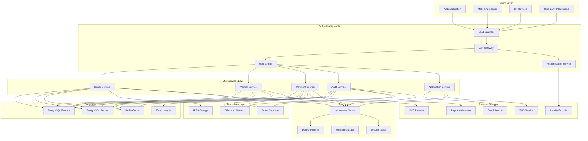
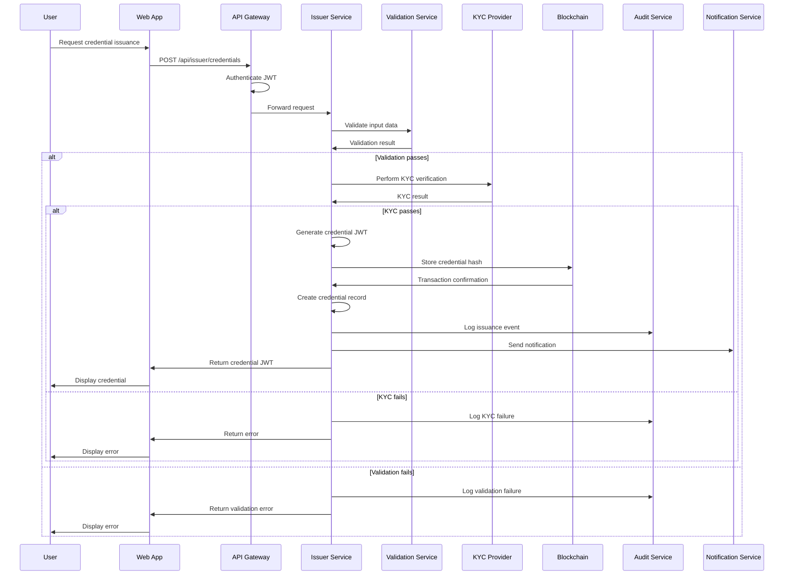
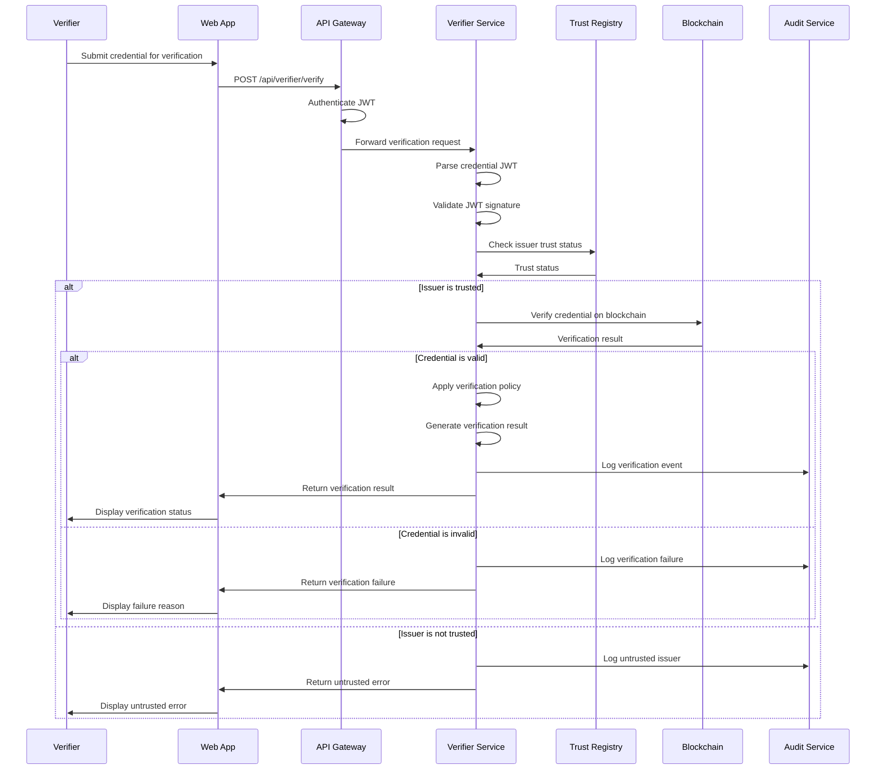
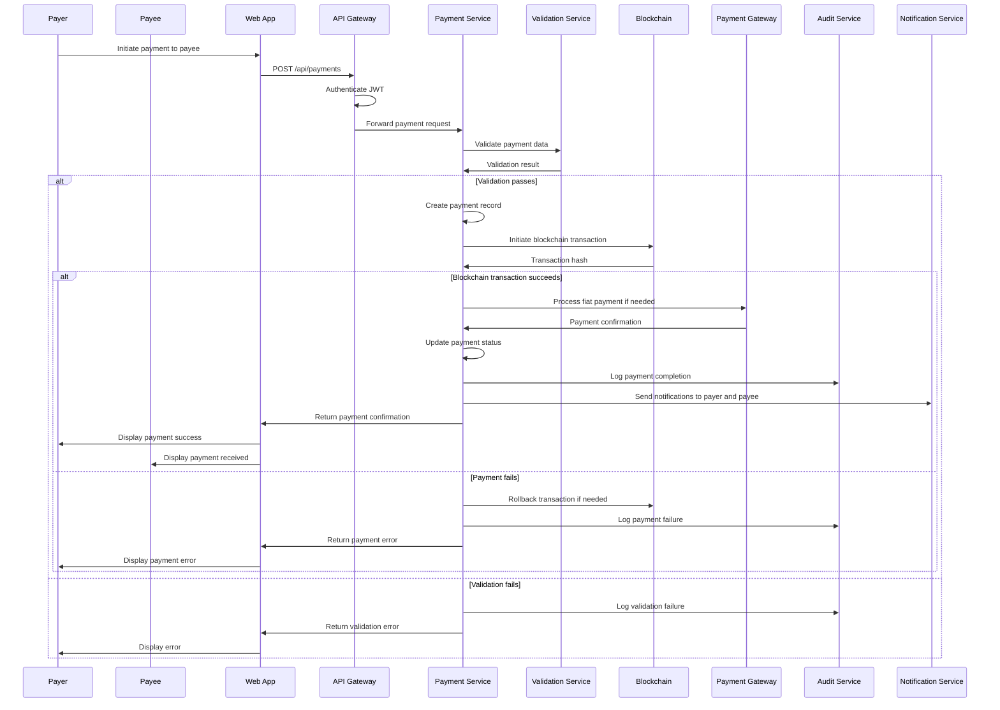
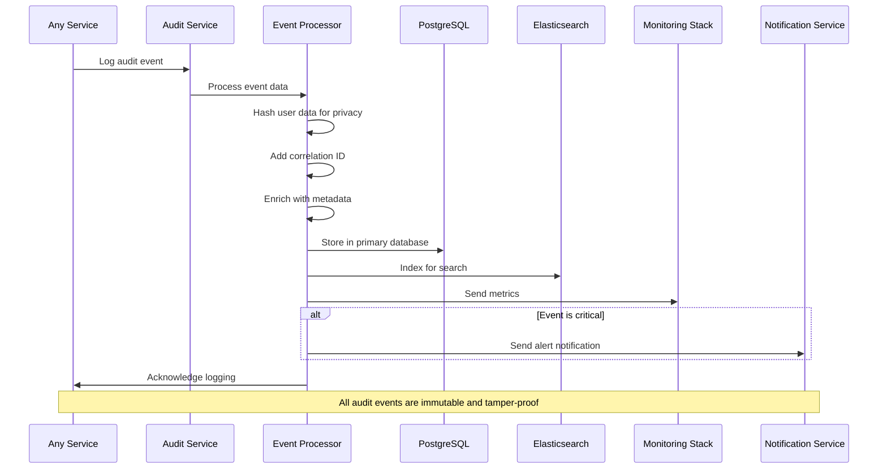
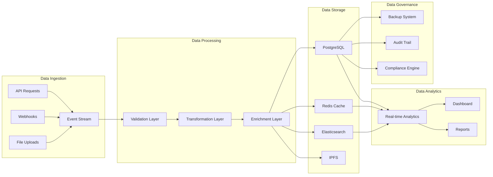
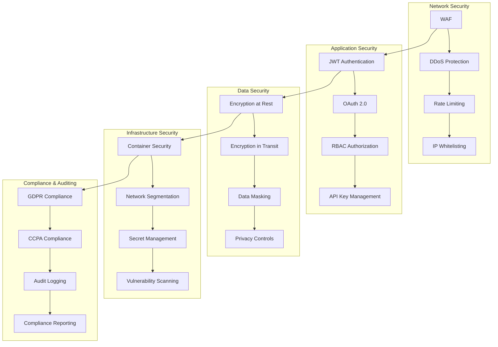
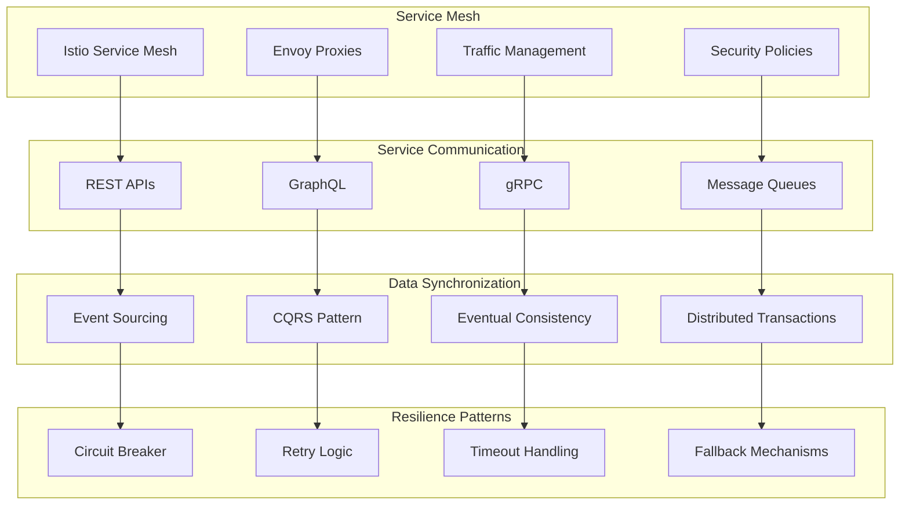
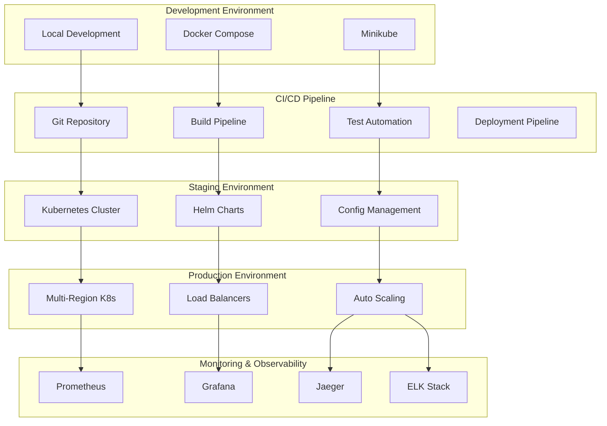

# FinPass Architecture Documentation

## System Architecture Overview

## Credential Issuance Flow

## Credential Verification Flow

## Payment Processing Flow

## Audit Logging Flow

## Data Flow Architecture

## Security Architecture

## Microservices Communication

## Deployment Architecture

## Technology Stack

### Backend Technologies
- **Framework**: Spring Boot 3.4.1
- **Language**: Java 17
- **Database**: PostgreSQL 14+
- **Cache**: Redis 6+
- **Search**: Elasticsearch 8+
- **Message Queue**: RabbitMQ / Apache Kafka
- **Blockchain**: Web3j (Ethereum)

### Frontend Technologies
- **Framework**: React 18+
- **Language**: TypeScript 5+
- **State Management**: Redux Toolkit
- **UI Components**: Material-UI / Ant Design
- **Build Tool**: Vite / Webpack

### Infrastructure Technologies
- **Containerization**: Docker
- **Orchestration**: Kubernetes
- **Service Mesh**: Istio
- **Monitoring**: Prometheus + Grafana
- **Logging**: ELK Stack
- **Tracing**: Jaeger

### Security Technologies
- **Authentication**: JWT + OAuth 2.0
- **Authorization**: RBAC + ABAC
- **Encryption**: AES-256 + TLS 1.3
- **API Security**: Rate Limiting + WAF

### DevOps Technologies
- **CI/CD**: Jenkins / GitLab CI
- **Infrastructure as Code**: Terraform
- **Configuration**: Helm Charts
- **Secret Management**: HashiCorp Vault

## Performance Considerations

### Database Optimization
- **Indexing Strategy**: Optimized for query patterns
- **Connection Pooling**: HikariCP configuration
- **Read Replicas**: Read scaling for analytics
- **Partitioning**: Time-based partitioning for audit data

### Caching Strategy
- **Application Cache**: Redis for frequently accessed data
- **CDN**: Static asset distribution
- **API Response Caching**: Configurable TTL
- **Session Caching**: Distributed session management

### Scalability Patterns
- **Horizontal Scaling**: Stateless microservices
- **Auto Scaling**: Based on CPU/memory metrics
- **Load Balancing**: Round-robin with health checks
- **Circuit Breaker**: Fault tolerance patterns

### Monitoring & Alerting
- **Application Metrics**: Custom business metrics
- **Infrastructure Metrics**: System resource monitoring
- **Error Tracking**: Comprehensive error logging
- **Performance Monitoring**: APM integration

## Compliance & Governance

### Data Privacy
- **GDPR Compliance**: Right to be forgotten, data portability
- **CCPA Compliance**: Consumer privacy rights
- **Data Minimization**: Collect only necessary data
- **Consent Management**: Granular consent controls

### Audit Requirements
- **Immutable Logs**: Tamper-proof audit trail
- **Data Retention**: Configurable retention policies
- **Access Logging**: Complete access audit
- **Change Tracking**: Configuration change audit

### Security Standards
- **ISO 27001**: Information security management
- **SOC 2**: Security and compliance controls
- **PCI DSS**: Payment card industry standards
- **HIPAA**: Healthcare data protection (if applicable)
