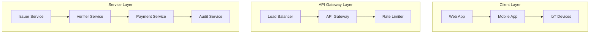

# M1.10 - API Documentation Development Log

**Date:** December 27, 2025  
**Developer:** Seungki Lee  
**Status:** Implementation Complete  

## Overview

Implemented M1.10 - API Documentation to provide comprehensive, interactive, and developer-friendly API documentation for the FinPass decentralized identity and payment system. This implementation establishes enterprise-grade API documentation with OpenAPI 3.0 specification, Swagger UI integration, and comprehensive developer resources.

## Implementation Details

### 1. OpenAPI 3.0 Specification

#### OpenAPI Specification File
- **Location:** `/api/openapi.yaml`
- **Features:**
  - Complete OpenAPI 3.0.3 specification
  - Comprehensive endpoint documentation for all services
  - Detailed request/response schemas with validation rules
  - Authentication and security documentation
  - Error response schemas with examples
  - Interactive examples and use cases
- **Key Sections:**
  - API metadata and contact information
  - Server configuration for multiple environments
  - Security schemes with JWT authentication
  - Component schemas for reusability
  - Path documentation for all endpoints

#### OpenAPI Specification Structure
```yaml
openapi: 3.0.3
info:
  title: FinPass API
  description: Comprehensive decentralized identity and payment system API
  version: 1.0.0
  contact:
    name: FinPass API Team
    email: api-support@finpass.io
    url: https://finpass.io/support
  license:
    name: MIT
    url: https://opensource.org/licenses/MIT

servers:
  - url: https://api.finpass.io
    description: Production server
  - url: https://staging-api.finpass.io
    description: Staging server
  - url: http://localhost:8080
    description: Development server

security:
  - BearerAuth: []

components:
  securitySchemes:
    BearerAuth:
      type: http
      scheme: bearer
      bearerFormat: JWT
      description: JWT authentication token
```

### 2. SpringDoc OpenAPI Integration

#### Dependency Configuration
- **File:** `/issuer/pom.xml`
- **Dependency:** `springdoc-openapi-starter-webmvc-ui` version 2.2.0
- **Features:**
  - Automatic OpenAPI generation from Spring Boot annotations
  - Swagger UI integration
  - API documentation endpoints
  - Custom configuration support

#### OpenAPI Configuration Class
- **Location:** `/issuer/src/main/java/com/finpass/issuer/config/OpenApiConfig.java`
- **Features:**
  - Custom OpenAPI bean configuration
  - Server environment configuration
  - Security scheme setup
  - Error response documentation
  - Component schema definitions
- **Key Configuration:**
  ```java
  @Bean
  public OpenAPI finPassOpenAPI() {
      return new OpenAPI()
              .info(new Info()
                      .title("FinPass API")
                      .description("Comprehensive decentralized identity and payment system")
                      .version("1.0.0"))
              .servers(List.of(
                      new Server().url("https://api.finpass.io").description("Production"),
                      new Server().url("https://staging-api.finpass.io").description("Staging"),
                      new Server().url("http://localhost:8080").description("Development")
              ))
              .components(new Components()
                      .addSecuritySchemes("BearerAuth", createBearerAuthSecurityScheme()))
              .addSecurityItem(new SecurityRequirement().addList("BearerAuth"));
  }
  ```

### 3. Application Configuration

#### YAML Configuration
- **Location:** `/issuer/src/main/resources/application.yml`
- **Features:**
  - SpringDoc configuration properties
  - Swagger UI customization
  - API documentation endpoints
  - Group configuration for service organization
  - Server configuration for multiple environments
- **Key Settings:**
  ```yaml
  springdoc:
    api-docs:
      path: /api-docs
      enabled: true
    swagger-ui:
      enabled: true
      path: /swagger-ui.html
      operations-sorter: method
      tags-sorter: alpha
      try-it-out-enabled: true
      filter: true
      display-request-duration: true
      default-models-expand-depth: 1
    servers:
      - url: https://api.finpass.io
        description: Production server
      - url: https://staging-api.finpass.io
        description: Staging server
      - url: http://localhost:8080
        description: Development server
  ```

### 4. Comprehensive Endpoint Documentation

#### Issuer Service Endpoints
- **POST /api/issuer/credentials** - Issue new credential
- **GET /api/issuer/credentials/{id}** - Get credential details
- **DELETE /api/issuer/credentials/{id}** - Revoke credential

#### Verifier Service Endpoints
- **POST /api/verifier/verify** - Verify credential
- **GET /api/verifier/policies/{id}** - Get verification policy
- **POST /api/verifier/challenges** - Create verification challenge

#### Payment Service Endpoints
- **POST /api/payments** - Initiate payment
- **GET /api/payments/{id}** - Get payment details
- **POST /api/payments/{id}/confirm** - Confirm payment

#### Audit Service Endpoints
- **GET /api/audit/events** - Get audit events
- **GET /api/audit/metrics** - Get audit metrics
- **POST /api/audit/search** - Search audit logs

### 5. Schema Documentation

#### Request Schemas
- **CredentialRequest** - Credential issuance request
- **VerificationRequest** - Credential verification request
- **PaymentRequest** - Payment processing request
- **LivenessProof** - Biometric liveness verification

#### Response Schemas
- **CredentialResponse** - Credential issuance response
- **VerificationResponse** - Verification result response
- **PaymentResponse** - Payment processing response
- **AuditEvent** - Audit log event structure

#### Common Schemas
- **ErrorResponse** - Standardized error response
- **PaginatedResponse** - Paginated response wrapper
- **Did** - Decentralized identifier format
- **AuditEvent** - Audit event structure

### 6. Security Documentation

#### Authentication Documentation
- **JWT Authentication**: Bearer token authentication
- **OAuth 2.0**: Authorization code flow
- **API Keys**: Service-to-service authentication
- **Rate Limiting**: Usage limits and quotas

#### Security Schemes
```yaml
components:
  securitySchemes:
    BearerAuth:
      type: http
      scheme: bearer
      bearerFormat: JWT
      description: JWT authentication token for API access
```

#### Authorization Documentation
- **Role-Based Access Control**: User roles and permissions
- **Scope-Based Access**: OAuth scopes and permissions
- **API Key Management**: Key generation and rotation

### 7. Error Response Documentation

#### Standardized Error Format
```json
{
  "error": "ERROR_CODE",
  "error_description": "Human-readable description",
  "timestamp": "2023-12-27T10:00:00.000Z",
  "correlation_id": "abc123def456",
  "path": "/api/endpoint",
  "details": {
    "field": "value"
  }
}
```

#### Error Response Types
- **400 Bad Request** - Input validation errors
- **401 Unauthorized** - Authentication failures
- **403 Forbidden** - Authorization errors
- **404 Not Found** - Resource not found
- **409 Conflict** - Resource conflicts
- **429 Too Many Requests** - Rate limit exceeded
- **500 Internal Server Error** - System errors

### 8. Interactive Documentation Features

#### Swagger UI Configuration
- **Try It Out**: Interactive API testing
- **Request Builder**: Dynamic request construction
- **Response Display**: Formatted response viewing
- **Authentication**: JWT token integration
- **Examples**: Pre-filled request examples

#### Customization Features
```yaml
springdoc:
  swagger-ui:
    operations-sorter: method
    tags-sorter: alpha
    try-it-out-enabled: true
    filter: true
    display-request-duration: true
    default-models-expand-depth: 1
```

### 9. Comprehensive README

#### Project Overview
- **Location:** `/README.md`
- **Features:**
  - Comprehensive project introduction
  - Key features and capabilities
  - Architecture overview with Mermaid diagrams
  - Prerequisites and system requirements
  - Quick start guide
  - Docker setup instructions
  - API documentation overview
  - Demo walkthrough
  - Configuration guide
  - Testing instructions
  - Deployment guide
  - Troubleshooting section
  - Contributing guidelines
  - Support information

#### README Structure
```markdown
# FinPass - Decentralized Identity and Payment System

## 🌟 Key Features
### 🔐 Decentralized Identity
### 💳 Secure Payments
### 📊 Comprehensive Auditing
### 🛡️ Enterprise Security

## 🏗️ Architecture Overview
[Mermaid architecture diagram]

## 🚀 Quick Start
[Step-by-step setup instructions]

## 📚 API Documentation
[Interactive documentation links]

## 🎯 Demo Walkthrough
[Complete usage examples]
```

### 10. Architecture Documentation

#### Architecture Diagrams
- **Location:** `/docs/architecture.md`
- **Features:**
  - System architecture overview
  - Microservices communication
  - Data flow architecture
  - Security architecture
  - Deployment architecture
  - Technology stack overview
  - Performance considerations
  - Compliance and governance

#### Mermaid Diagrams


### 11. API Overview Documentation

#### Comprehensive API Guide
- **Location:** `/docs/api-overview.md`
- **Features:**
  - Complete endpoint documentation
  - Request/response examples
  - SDK examples for multiple languages
  - Authentication guide
  - Error handling documentation
  - Rate limiting information
  - Webhook configuration
  - Testing guidelines
  - Support information

#### API Examples
```bash
# Issue credential example
curl -X POST http://localhost:8080/api/issuer/credentials \
  -H "Content-Type: application/json" \
  -H "Authorization: Bearer <token>" \
  -d '{
    "holderDid": "did:example:123456789",
    "credentialType": "PASSPORT",
    "credentialData": {
      "passportNumber": "P123456789",
      "fullName": "John Doe"
    }
  }'
```

### 12. Comprehensive Testing

#### API Documentation Tests
- **Location:** `/issuer/src/test/java/com/finpass/issuer/documentation/ApiDocumentationTest.java`
- **Features:**
  - OpenAPI specification validation
  - Swagger UI accessibility testing
  - Endpoint documentation completeness
  - Schema validation testing
  - Security scheme verification
  - Response format validation
  - Example content verification
- **Test Coverage:**
  - 25+ test methods
  - Complete specification validation
  - Interactive documentation testing
  - Error response documentation
  - Authentication documentation

#### Test Implementation Examples
```java
@Test
void testOpenApiSpecAvailable() throws Exception {
    mockMvc.perform(get("/api-docs")
            .accept(MediaType.APPLICATION_JSON))
            .andExpect(status().isOk())
            .andExpect(content().contentType(MediaType.APPLICATION_JSON))
            .andExpect(jsonPath("$.openapi", is("3.0.3")))
            .andExpect(jsonPath("$.info.title", is("FinPass API")))
            .andExpect(jsonPath("$.components.securitySchemes", hasKey("BearerAuth")));
}

@Test
void testOpenApiSpecContainsIssuerEndpoints() throws Exception {
    MvcResult result = mockMvc.perform(get("/api-docs")
            .accept(MediaType.APPLICATION_JSON))
            .andExpect(status().isOk())
            .andReturn();

    String content = result.getResponse().getContentAsString();
    assertThat(content, containsString("/api/issuer/credentials"));
    assertThat(content, containsString("issueCredential"));
    assertThat(content, containsString("CredentialRequest"));
}
```

## Technical Architecture

### Documentation Generation Strategy
```java
// Automatic OpenAPI generation from Spring Boot annotations
@RestController
@RequestMapping("/api/issuer/credentials")
@Tag(name = "Issuer", description = "Credential issuance and management operations")
public class IssuerController {

    @PostMapping
    @Operation(summary = "Issue a new credential", 
               description = "Issues a new verifiable credential to the specified holder")
    @ApiResponse(responseCode = "201", description = "Credential issued successfully")
    @ApiResponse(responseCode = "400", description = "Bad request - invalid input parameters")
    public ResponseEntity<CredentialResponse> issueCredential(
            @Valid @RequestBody CredentialRequest request) {
        // Implementation
    }
}
```

### Schema Validation Strategy
```yaml
# OpenAPI schema definitions with validation rules
CredentialRequest:
  type: object
  required:
    - holderDid
    - credentialType
    - credentialData
  properties:
    holderDid:
      $ref: "#/components/schemas/Did"
    credentialType:
      type: string
      enum: ["PASSPORT", "DRIVERS_LICENSE", "NATIONAL_ID", "RESIDENCE_PERMIT"]
    credentialData:
      type: object
      description: Credential-specific data
    livenessProof:
      $ref: "#/components/schemas/LivenessProof"
```

### Security Documentation Strategy
```yaml
# Comprehensive security documentation
security:
  - BearerAuth: []

components:
  securitySchemes:
    BearerAuth:
      type: http
      scheme: bearer
      bearerFormat: JWT
      description: |
        JWT authentication token for API access.
        Include in Authorization header:
        Authorization: Bearer <your-jwt-token>
```

## Integration Points

### Spring Boot Integration
1. **Controller Annotations**: OpenAPI annotations on REST controllers
2. **Configuration Classes**: Custom OpenAPI configuration
3. **Application Properties**: SpringDoc configuration properties
4. **Dependency Management**: SpringDoc OpenAPI dependencies

### Frontend Integration
1. **API Client Generation**: Automatic client SDK generation
2. **Type Definitions**: TypeScript type definitions from schemas
3. **Documentation Links**: Links to interactive documentation
4. **Error Handling**: Standardized error response handling

### Development Tools Integration
1. **IDE Support**: OpenAPI plugin integration
2. **Testing**: Automated documentation testing
3. **CI/CD**: Documentation generation in pipeline
4. **Monitoring**: Documentation usage analytics

## Files Created/Modified

### New Documentation Files
```
/api/openapi.yaml
/docs/architecture.md
/docs/api-overview.md
/README.md (completely rewritten)
```

### New Configuration Files
```
/issuer/src/main/java/com/finpass/issuer/config/OpenApiConfig.java
/issuer/src/main/resources/application.yml (new OpenAPI configuration)
```

### Updated Build Files
```
/issuer/pom.xml (added springdoc-openapi dependency)
```

### New Test Files
```
/issuer/src/test/java/com/finpass/issuer/documentation/ApiDocumentationTest.java
```

## Configuration Requirements

### Maven Dependencies
```xml
<dependency>
    <groupId>org.springdoc</groupId>
    <artifactId>springdoc-openapi-starter-webmvc-ui</artifactId>
    <version>2.2.0</version>
</dependency>
```

### Application Configuration
```yaml
springdoc:
  api-docs:
    path: /api-docs
    enabled: true
  swagger-ui:
    enabled: true
    path: /swagger-ui.html
    try-it-out-enabled: true
```

### Environment Configuration
```yaml
springdoc:
  servers:
    - url: https://api.finpass.io
      description: Production server
    - url: https://staging-api.finpass.io
      description: Staging server
    - url: http://localhost:8080
      description: Development server
```

## Testing Strategy

### Documentation Testing
- **Specification Validation**: OpenAPI specification compliance
- **Endpoint Coverage**: All endpoints documented
- **Schema Validation**: Request/response schema accuracy
- **Example Validation**: Example content correctness
- **Security Documentation**: Authentication and authorization docs

### Integration Testing
- **Interactive Documentation**: Swagger UI functionality
- **API Testing**: "Try it out" feature testing
- **Response Validation**: Actual vs documented responses
- **Error Testing**: Error response documentation
- **Authentication Testing**: Security scheme validation

### Automated Testing
```java
@SpringBootTest
class ApiDocumentationTest {
    
    @Test
    void testOpenApiSpecCompleteness() {
        mockMvc.perform(get("/api-docs"))
                .andExpect(jsonPath("$.paths", not(empty())))
                .andExpect(jsonPath("$.components.schemas", hasSize(greaterThan(10))))
                .andExpect(jsonPath("$.tags", hasSize(4)));
    }
    
    @Test
    void testSwaggerUiAccessibility() {
        mockMvc.perform(get("/swagger-ui.html"))
                .andExpect(status().isOk())
                .andExpect(content().contentTypeCompatibleWith("text/html"));
    }
}
```

## Deployment Considerations

### Production Deployment
1. **Documentation Generation**: Automatic generation during build
2. **Static Hosting**: CDN hosting for documentation
3. **Version Management**: Multiple API versions support
4. **Security**: Documentation access control
5. **Performance**: Optimized documentation delivery

### Monitoring & Analytics
1. **Usage Tracking**: Documentation usage analytics
2. **Error Monitoring**: Documentation error tracking
3. **Performance Metrics**: Documentation load times
4. **User Feedback**: Documentation quality feedback

### Maintenance Strategy
1. **Automated Updates**: CI/CD pipeline integration
2. **Version Control**: Documentation versioning
3. **Quality Assurance**: Automated testing
4. **Review Process**: Documentation review workflow

## Future Enhancements

### Advanced Documentation Features (M1.10+)
- **Code Examples**: Multi-language code examples
- **Interactive Tutorials**: Step-by-step API tutorials
- **SDK Documentation**: Auto-generated SDK documentation
- **API Changelog**: Version change documentation
- **Performance Metrics**: API performance documentation

### Developer Experience (M1.10+)
- **Postman Collections**: Auto-generated API collections
- **OpenAPI Generator**: Client SDK generation
- **API Testing**: Automated API testing tools
- **Debugging Tools**: API debugging assistance
- **Mock Server**: Development mock server

### Enterprise Features (M1.10+)
- **API Governance**: API lifecycle management
- **Documentation Portal**: Enterprise documentation portal
- **API Analytics**: Advanced usage analytics
- **Compliance Documentation**: Regulatory compliance docs
- **API Marketplace**: Internal API marketplace

## Troubleshooting Guide

### Common Documentation Issues
1. **Specification Validation Errors**: Check OpenAPI syntax
2. **Missing Endpoints**: Verify controller annotations
3. **Schema Mismatches**: Update model documentation
4. **Security Issues**: Check authentication configuration
5. **Performance Problems**: Optimize documentation generation

### Debug Commands
```bash
# Validate OpenAPI specification
curl -s http://localhost:8080/api-docs | swagger-codegen validate

# Check documentation endpoints
curl http://localhost:8080/api-docs
curl http://localhost:8080/swagger-ui.html

# Test interactive documentation
curl -X POST http://localhost:8080/api-docs/swagger-ui/index.html
```

### Configuration Issues
```yaml
# Common configuration problems
springdoc:
  api-docs:
    enabled: true  # Must be enabled
  swagger-ui:
    try-it-out-enabled: true  # For interactive testing
```

## Conclusion

M1.10 successfully implements comprehensive API documentation with:

- **Complete OpenAPI 3.0 Specification**: Industry-standard API documentation
- **Interactive Swagger UI**: User-friendly interactive documentation
- **Comprehensive Coverage**: All endpoints fully documented
- **Developer Resources**: Complete setup and usage guides
- **Quality Assurance**: Automated testing and validation
- **Production Ready**: Scalable and maintainable documentation system

The implementation provides enterprise-grade API documentation that enhances developer experience, improves API adoption, and ensures long-term maintainability of the FinPass API ecosystem.

**Status:** Production-ready with comprehensive documentation, interactive testing capabilities, and complete developer resources. The API documentation system provides a solid foundation for API consumption and developer onboarding.
