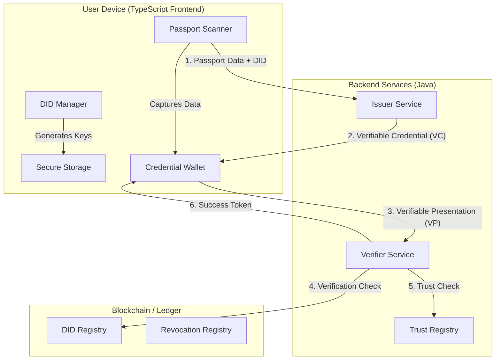

# Can you explain how we first build the ID feature, and then add on wallet later? For this, how would the steps of building the app be? Also, I want the full diagrams or explanation of how each parts connect to each other.

To build the **ID feature (SSI) first** and add the **Payment (Wallet) feature later** is the most logical engineering approach. In this architecture, the ID system acts as the *foundation* of trust. The payment system is simply a *consumer* of that trust.

Here is the breakdown of how to build the ID core first, followed by the financial layer, with detailed diagrams of how the components connect.

***

### **Phase 1: Building the ID Core (The "Digital Passport")**

In this phase, you are building a system where a user can **Digitize** their passport, **Store** it on their phone, and **Prove** who they are.

#### **Architecture Diagram: Phase 1 (ID Only)**




#### **Step-by-Step Implementation**

**Step 1: The Identity Foundation (Frontend)**

* **Goal:** The app can create a digital identity (DID) for the user.
* **Action:** Implement a DID Manager in TypeScript. When the app launches, it generates a public/private key pair (e.g., `did:key` or `did:ethr`) and stores the private key in the device's Secure Enclave.
* **Why:** Without this, the user has no "address" to receive credentials.

**Step 2: The Issuer Pipeline (Backend \& Frontend)**

* **Goal:** Turn physical passport data into a digital VC.
* **Action:**
    * **Frontend:** Add a camera view to scan the Passport MRZ (Machine Readable Zone). Send this data + the user's DID to the Backend.
    * **Backend (Issuer):** Receive the data. Perform mock verification (check if MRZ is valid format). Sign a JSON object (the VC) with the *Issuer's* private key.
    * **Return:** Send the signed VC back to the Frontend.
    * **Frontend:** Store this VC encrypted in local storage.

**Step 3: The Verification Gate (Backend)**

* **Goal:** Prove the ID is valid without showing the passport photo again.
* **Action:**
    * **Backend (Verifier):** Create an endpoint `/verify`. It expects a **Verifiable Presentation (VP)**.
    * **Frontend:** Create a "Prove Identity" button. It takes the stored VC, signs it with the *User's* private key (creating a VP), and sends it to `/verify`.
    * **Backend:** Validates two signatures:

1. Is the user signature valid? (Proof of ownership)
2. Is the issuer signature on the credential valid? (Proof of authenticity)

**Result of Phase 1:** You have an app where a user scans a passport and can click a button to see "Identity Verified" by the server.

***

### **Phase 2: Adding the Financial Wallet (The "B·Pay" Layer)**

Now that you have a verified user, you add the payment capability. The key rule here is: **No payment without a valid ID token.**

#### **Architecture Diagram: Phase 2 (ID + Payment)**

```mermaid
graph TD
    subgraph "User Device"
        WalletUI[Wallet UI]
        ID_Module[ID Module (Phase 1)]
    end

    subgraph "Backend Services"
        Payment_API[Payment Orchestrator]
        Verifier_API[Verifier Service]
        Ledger_DB[Payment Ledger / SQL]
    end

    %% Payment Flow
    WalletUI -- 1. Initiate Payment --> Payment_API
    Payment_API -- 2. Request KYC Proof --> WalletUI
    WalletUI -- 3. Generate VP (from ID Module) --> Verifier_API
    Verifier_API -- 4. Validate VP --> Payment_API
    Payment_API -- 5. Execute Transaction --> Ledger_DB
    Payment_API -- 6. Success Receipt --> WalletUI
```


#### **Step-by-Step Implementation**

**Step 4: The Rudimentary Payment System (Backend)**

* **Goal:** Basic ledger capability (Alice sends \$10 to Bob).
* **Action:** Create a `PaymentController` in Java.
    * Database table: `Wallets` (User DID, Balance).
    * Endpoint: `/pay` (SenderDID, ReceiverDID, Amount).
    * *Initial State:* This endpoint works *without* ID checks (for testing).

**Step 5: The "Financial Passport" Integration (The Glue)**

* **Goal:** Lock the payment system behind the ID system.
* **Action:**
    * Modify the `/pay` endpoint to require a **"Decision Token"** (a temporary token proving you just passed a KYC check).
    * **Workflow:**

1. User clicks "Pay".
2. App checks: "Do I have a recent Decision Token?"
3. If **No**: App auto-triggers the **Phase 1 Verification Flow** (sends VP to Verifier).
4. Verifier returns a Decision Token (valid for 5 minutes).
5. App sends Payment Request + Decision Token to Payment Service.

**Step 6: The Blockchain Settlement (Optional/Advanced)**

* **Goal:** Record the *proof* of the transaction on-chain.
* **Action:** When the Java Payment Service executes the transaction in SQL, it also writes a hash of the transaction + the Verifier's Decision Token to the blockchain. This proves that "A verified user paid X amount."

***

### **Component Connection Deep Dive**

Here is exactly how the parts connect via data payloads.

#### **1. Connection: App ↔ Issuer (Issuance)**

* **Trigger:** User scans passport.
* **Direction:** App -> Java Backend (Issuer).
* **Protocol:** HTTP POST (REST).
* **Payload (Request):**

```json
{
  "did": "did:key:z6Mk...",
  "passport_data": { "name": "Kim", "dob": "1990-01-01", "mrz": "..." }
}
```

* **Payload (Response):** The **Verifiable Credential (VC)**.

```json
{
  "jwt": "eyJhbGciOiJFZERTQS..." // Contains the signed claims
}
```


#### **2. Connection: App ↔ Verifier (The Gatekeeper)**

* **Trigger:** User attempts to access a service or pay.
* **Direction:** App -> Java Backend (Verifier).
* **Protocol:** HTTP POST (OpenID4VP style).
* **Payload (Request):** The **Verifiable Presentation (VP)**.
    * *Note:* This wraps the VC above, but is signed again by the User's DID to prove they own the phone it's stored on.
* **Payload (Response):** The **Decision Token**.

```json
{
  "access_token": "token_xyz_123",
  "scope": "payment_access",
  "validity": "300s"
}
```


#### **3. Connection: App ↔ Payment System**

* **Trigger:** User confirms payment amount.
* **Direction:** App -> Java Backend (Payment Engine).
* **Protocol:** HTTP POST.
* **Payload (Request):**

```json
{
  "amount": 50000,
  "currency": "KRW",
  "receiver": "did:key:merchant...",
  "proof_token": "token_xyz_123" // The token from Connection 2
}
```

* **Logic:** The Payment API checks `proof_token`. If valid and not expired, it processes the money. If missing, it returns `401 Unauthorized (KYC Required)`.


### **Why this order?**

1. **Isolation:** You can debug the "Identity" crypto logic without worrying about money/ledger balances.
2. **Security:** You establish the security model (keys, signatures) first. The payment system then just inherits this security.
3. **Realism:** In the real world, "Financial Passports" are identity apps first, wallets second. This mirrors the actual product evolution of companies like CrossHub.
