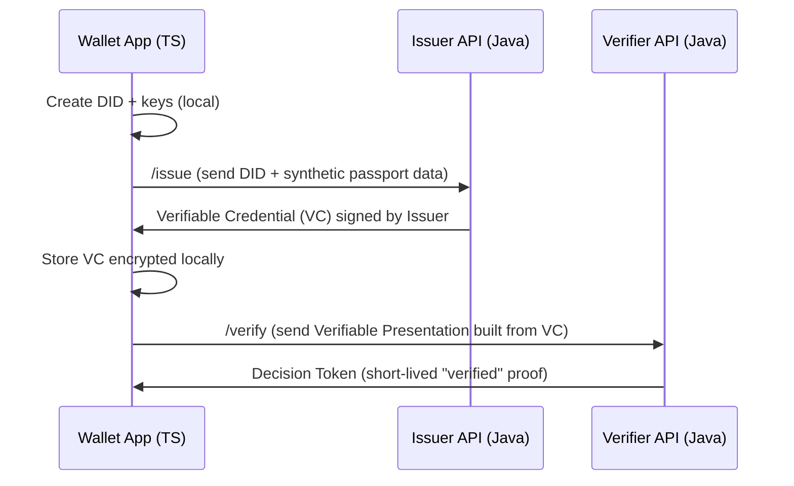
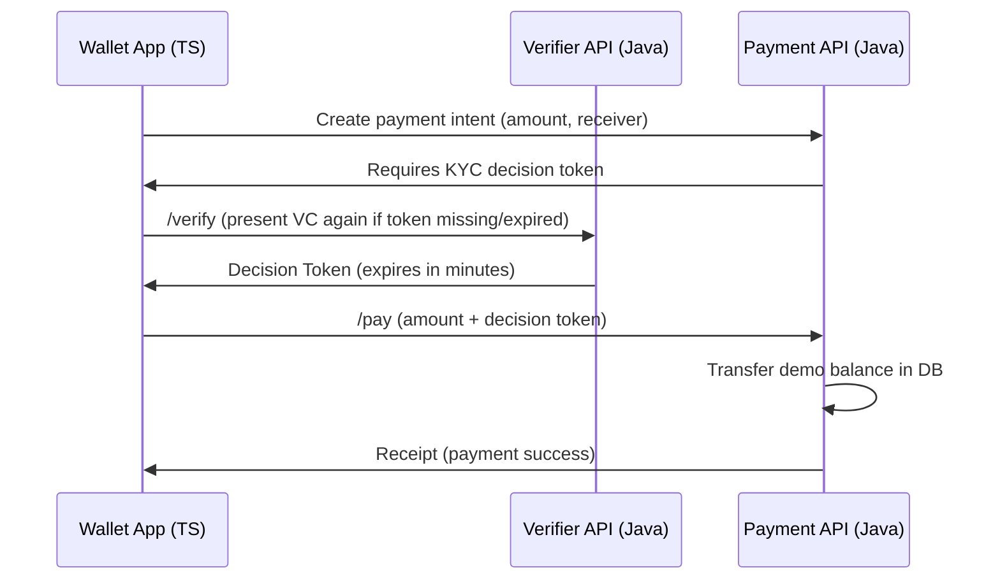

## Tech stack map

-Frontend (TypeScript)

- Wallet UI (web first): React + TypeScript for screens like “Create DID”, “Receive Credential”, “Present Credential”, and later “Pay”.
- Crypto/client SSI: a DID/VC library (e.g., Veramo-style agent pattern) to create keys/DIDs, store credentials, and sign presentations.

-Backend (Java)

- Issuer service: creates and signs credentials (VCs) and exposes an issuance API that your wallet calls (later shaped like OpenID4VCI).[^1]
- Verifier service: accepts presentations (VPs), validates signatures/status, and returns a short-lived “decision token” your app can use to unlock features (later shaped like OpenID4VP).[^2]

-Blockchain (PoC/MVP)

- Keep it minimal: store *trust anchors* (e.g., issuer public keys / registry hashes) rather than any passport data.
- This matches the common “universal wallet” idea where a wallet can hold identity + money, but doesn’t require putting personal data on-chain.[^3]

-Payments (added later)

- MVP payment is a **demo ledger** in your Java backend (balances + transfers) so you can test “KYC-gated payment” without a real PSP.
- The payment service simply requires a valid verifier decision token before allowing a transfer.

## Tools you’ll use (junior-friendly)

-Local dev tools

- Node.js + npm/pnpm: run the TypeScript wallet app.
- Java 17 + Maven/Gradle: build Spring Boot services.
- Docker + docker-compose: run backend + PostgreSQL locally in one command.

-API + debugging tools

- Postman/Insomnia: manually test `/issue`, `/present`, `/verify`, `/pay`.
- Swagger/OpenAPI: document your issuer/verifier/payment endpoints so the wallet knows exactly what to call.

-Standards/tooling guidance (when you “upgrade” from simple REST to standard flows)

- Use OpenID4VCI concepts for issuance (wallet fetches issuer metadata, then requests a credential).[^1]
- Use OpenID4VP concepts for presentation/verification (wallet sends a VP to a verifier endpoint).[^2]

## Simulating a “digital passport” safely

You do *not* need a real passport to prototype the architecture, and you should avoid real PII during development.

-Safest approach (recommended for PoC/MVP): “Fake Passport VC”

- Define a `PassportCredential` VC schema that includes only the fields you need to demo (e.g., `fullName`, `birthDate`, `nationality`, `expiryDate`, `passportVerified=true`).
- Generate synthetic values (faker data) and have your **Issuer Service** sign it, exactly like it would for real data.

-If you want “MRZ-like” realism without PII

- ICAO Doc 9303 defines the structure of machine-readable travel documents (MRZ concepts, formatting rules).[^4]
- You can generate MRZ-style strings using open-source MRZ generator libraries and feed those into your proofing pipeline; academic work describing synthetic passports explicitly mentions MRZ generation via open-source tooling aligned to ICAO constraints.[^5]
- In your UI, show “Passport scanned” using a synthetic image/template and synthetic MRZ—never a real photo.

-If you want realistic sample images (still not real passports)

- Use a synthetic passport dataset approach: research exists on generating passport-like images (face, text, MRZ) using synthetic/hybrid methods to avoid real identity exposure.[^5]

## How parts connect (ID first, wallet/pay later)

Below are the two “connection diagrams” you’ll implement in order.

### ID-only (PoC/MVP)

### Add “wallet/payments” after ID works

If the goal is “ID first, payments later,” the key rule is: **payments never touch passport data**—they only accept the verifier’s short-lived decision token, which keeps identity and money cleanly separated.
[^10][^11][^12][^13][^14][^15][^16][^17][^18][^19][^20][^6][^7][^8][^9]

⁂

[^1]: https://docs.walt.id/concepts/data-exchange-protocols/openid4vci

[^2]: https://docs.walt.id/enterprise-stack/services/verifier-service/credential-verification/vc-oid4vc

[^3]: https://github.com/openwallet-foundation/architecture-sig/blob/main/docs/papers/architecture-whitepaper.md

[^4]: https://www.icao.int/sites/default/files/publications/DocSeries/9303_p1_cons_en.pdf

[^5]: https://arxiv.org/html/2505.07540v1

[^6]: https://github.com/openwallet-foundation/architecture-sig/wiki

[^7]: https://github.com/tkuhrt/owf-architecture-sig/blob/architecture-wp/docs/papers/architecture-whitepaper.md

[^8]: https://openwallet.foundation

[^9]: https://w3c-ccg.github.io/universal-wallet-interop-spec/

[^10]: https://github.com/openwallet-foundation

[^11]: https://www.youtube.com/watch?v=VZrYZrQPbw0

[^12]: https://www.linuxfoundation.org/blog/davos-panel-building-the-best-future-for-digital-universal-wallet-infrastructure-with-the-openwallet-foundation

[^13]: https://www.youtube.com/watch?v=cnxEljh8eyU

[^14]: https://www.icao.int/sites/default/files/publications/DocSeries/9303_p2_cons_en.pdf

[^15]: https://www.youtube.com/watch?v=mWoh3C2doJ0

[^16]: https://www.icao.int/sites/default/files/publications/DocSeries/9303_p4_cons_en.pdf

[^17]: https://github.com/openwallet-foundation/architecture-sig/discussions

[^18]: https://github.com/walt-id/waltid-openid4vc

[^19]: https://www.linkedin.com/pulse/convergence-global-identification-standards-examining-ott-sarv-zvuof

[^20]: https://openwallet.foundation/wp-content/uploads/sites/11/2023/02/OpenWallet-Foundation-Overview-2023.02.09.pdf

